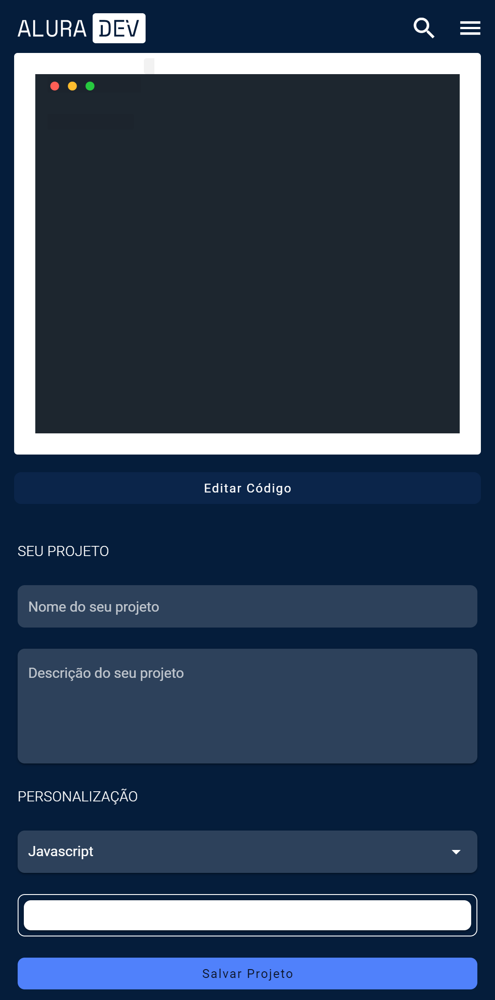
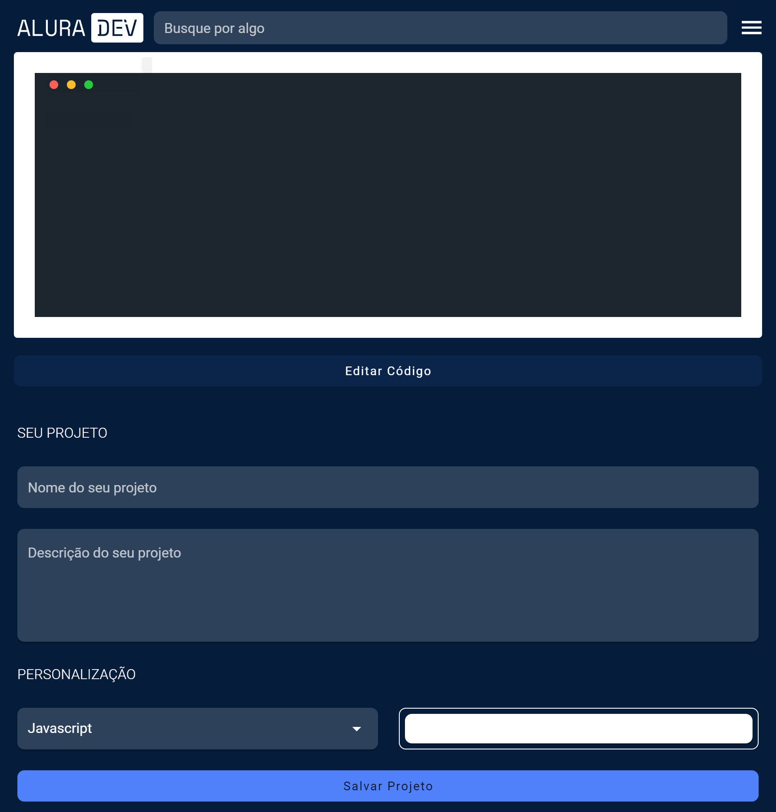
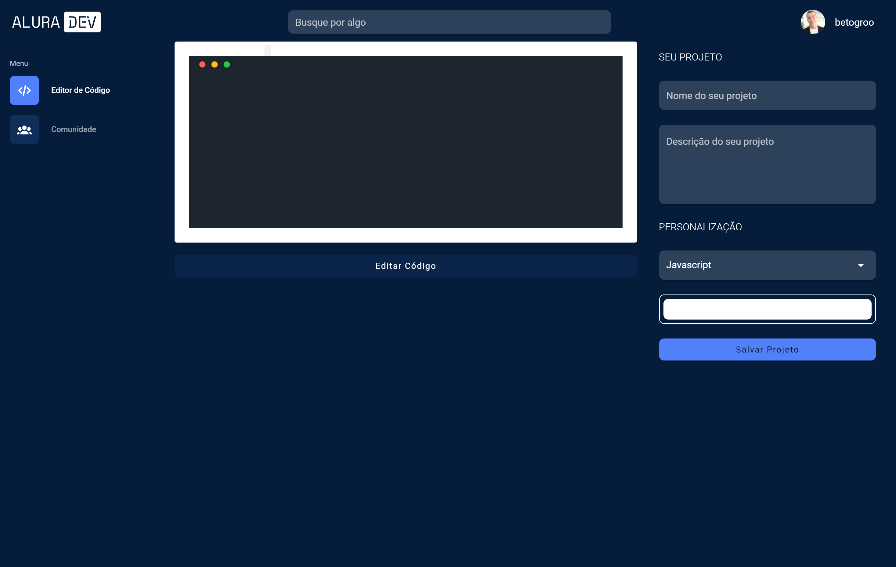
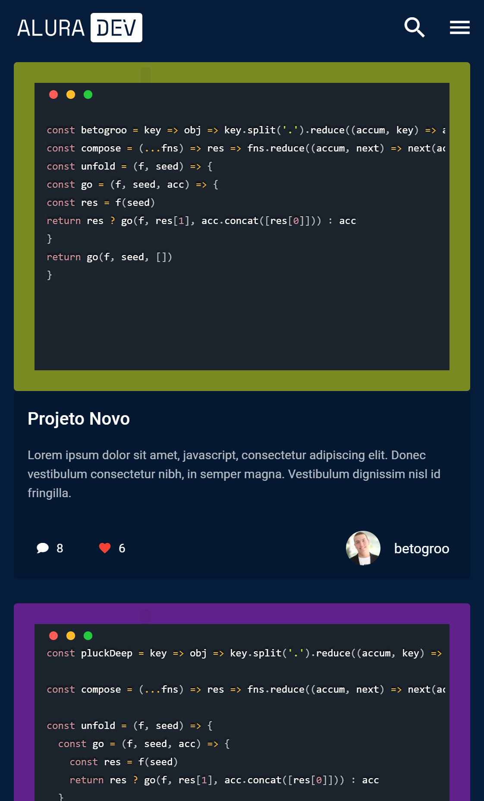
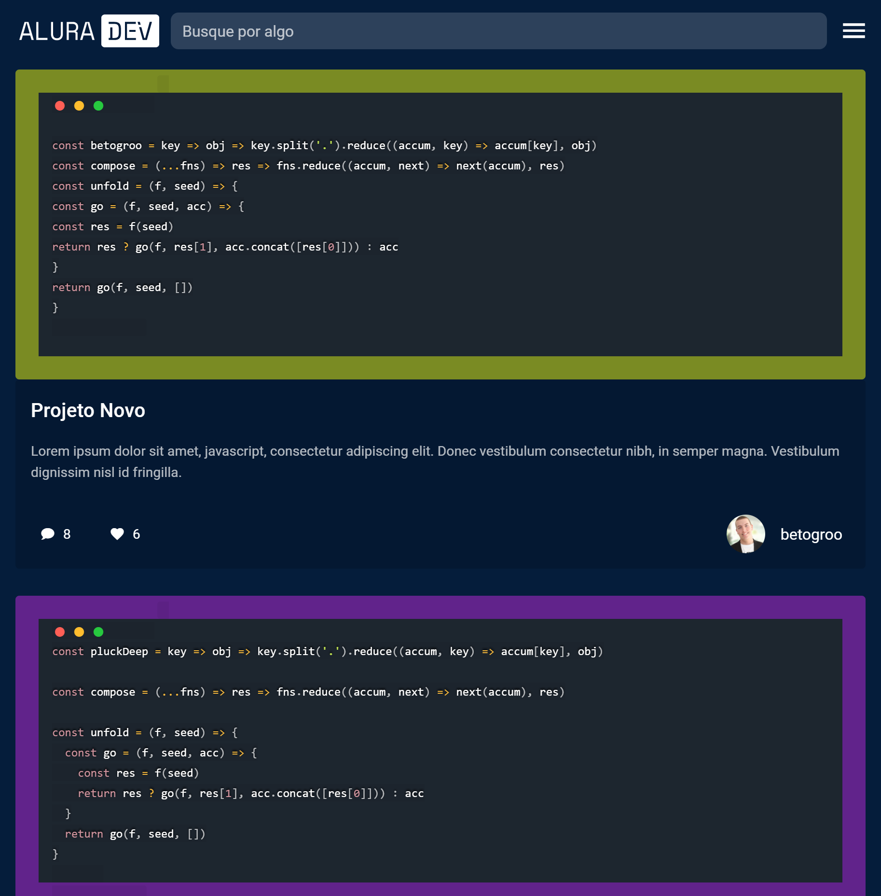
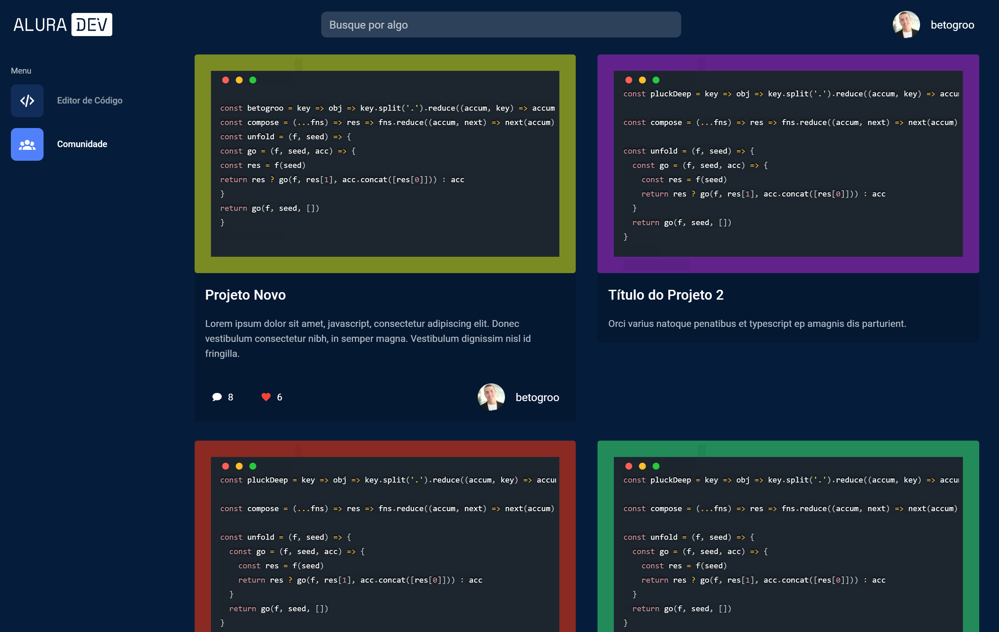
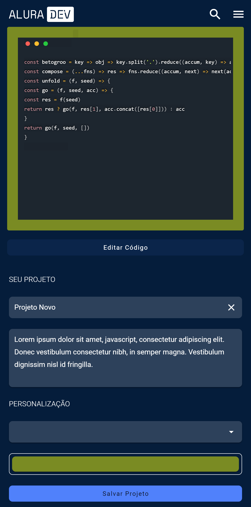
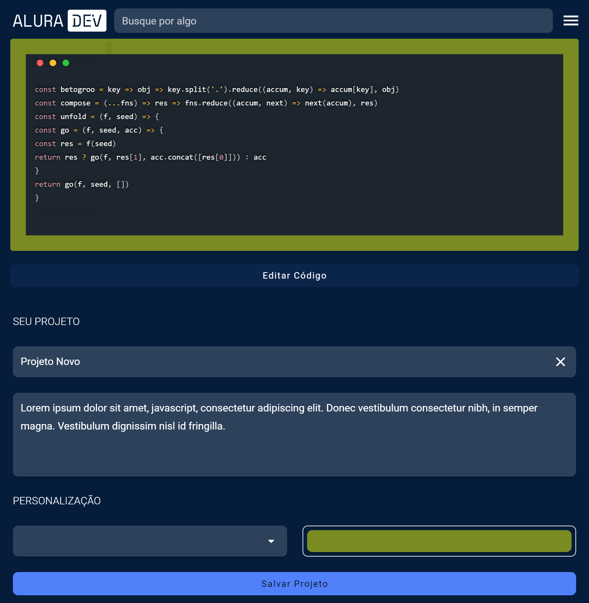
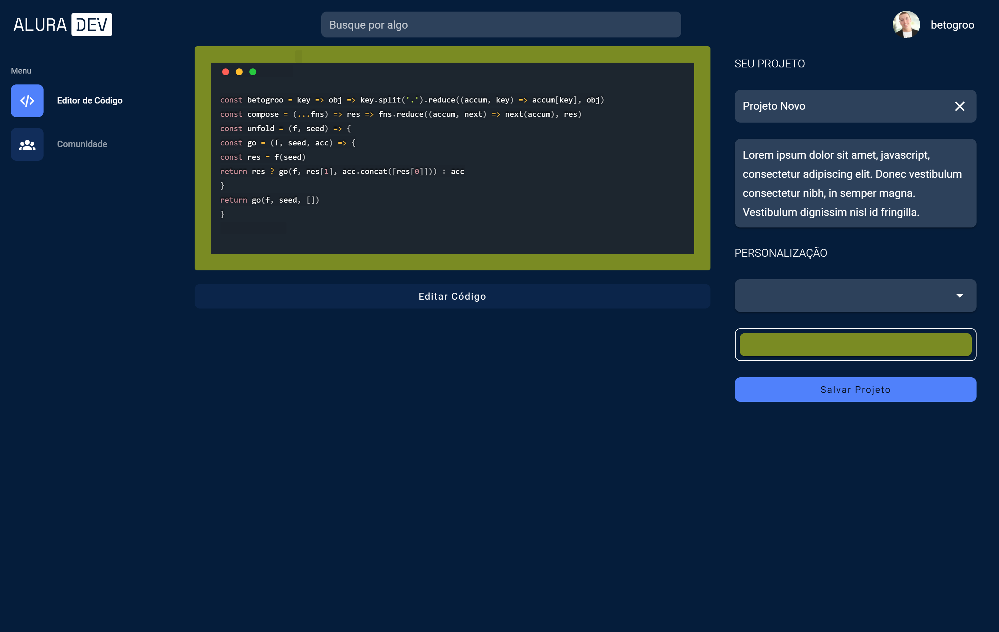

<h1> 
 Alura Challenge Front-end
</h1>

## Tecnologias:

|||
|---|---|---|
|  VueJs |  Vuetify | Sass |


## Sobre o projeto
Trata-se de um projeto, disponibilizado pela Alura, onde, durante quatro semanas vamos simular o desenvolvimento completo  do Front-end de uma aplicação, desde a análise do design desenvolvido no Figma, até o layout final. Cada passo está especificado em um card no Trello.
A aplicação será um editor de texto online para postar trechos de códigos. Nele, um produtor de conteúdo escreve um código tem a opção de selecionar a linguagem de programação e visualizar o mesmo com formatação, além de visualizar projetos de outros usuários.
A aplicação é responsiva, podendo ser acessada de celular, tablet e desktop, com as mesmas funcionalidades, adaptadas a cada tamanho de tela


### Tela Inicial
###### Apresenta um campo para digitar o código, além do formulário, para escolha da linguagem, cor, título e descrição. Também tem um botão, com a funcionalidade de verificar o código com formatação (Highlight)
| Dispositivo  | Tela  |
|:--|:-:|
|  Mobile |   |
|  Tablet |   |
|  Desktop |   |

### Tela dos Projetos
##### Apresenta os projetos salvos, com miniatura do código, título, descrição, autor. Mostra também a quantidade de comentários e curtidas. Ao clicar na miniatura, será apresentada a tela de detalhes do projeto
| Dispositivo  | Tela  |
|:--|:-:|
|  Mobile |   |
|  Tablet |   |
|  Desktop |   |

### Tela dos Detalhe do Projeto
##### Apresenta os detalhes do projeto, possibilitando a edição.
| Dispositivo  | Tela  |
|:--|:-:|
|  Mobile |   |
|  Tablet |   |
|  Desktop |   |

### Live Preview
- [Render](https://alura-challenge.onrender.com/)

## Instalação

``` 
git clone https://github.com/betogroo/alura-challenge.git

cd vue_when_do

npm install
```

## Rodando a aplicação

```
npm run serve

```
